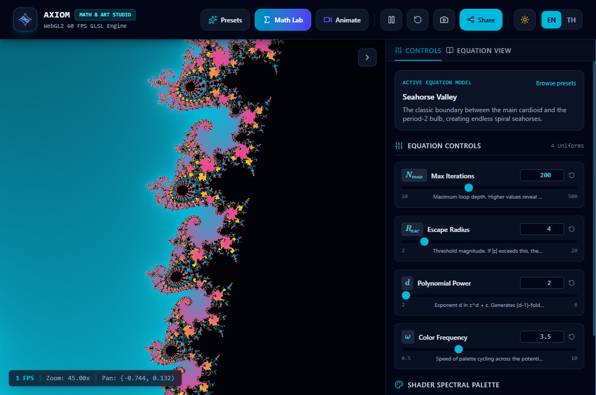
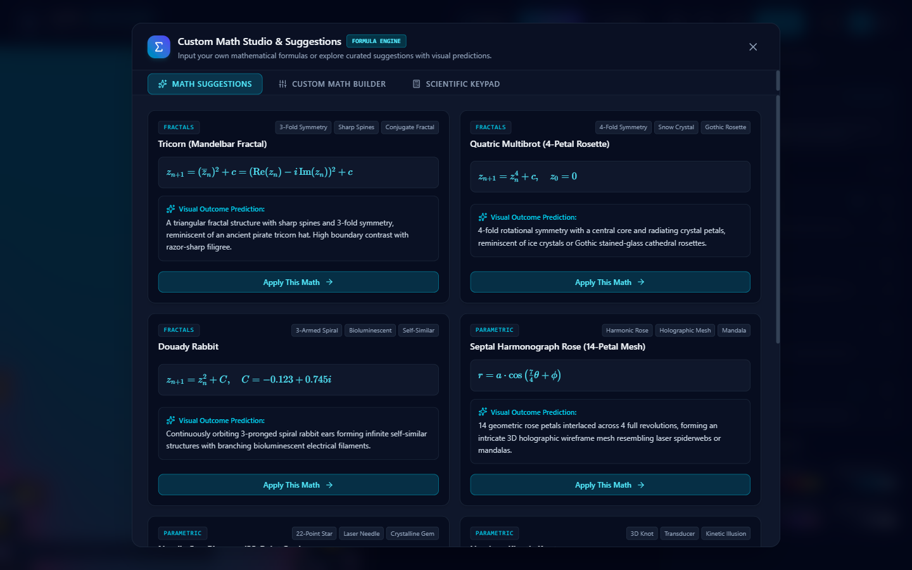
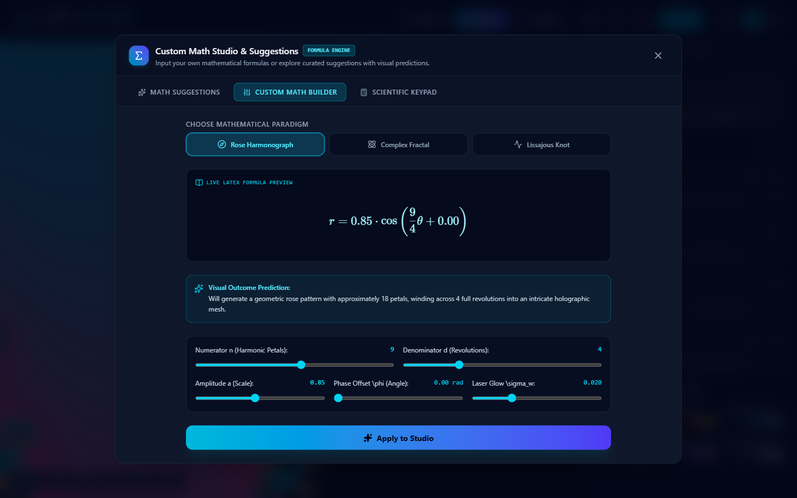
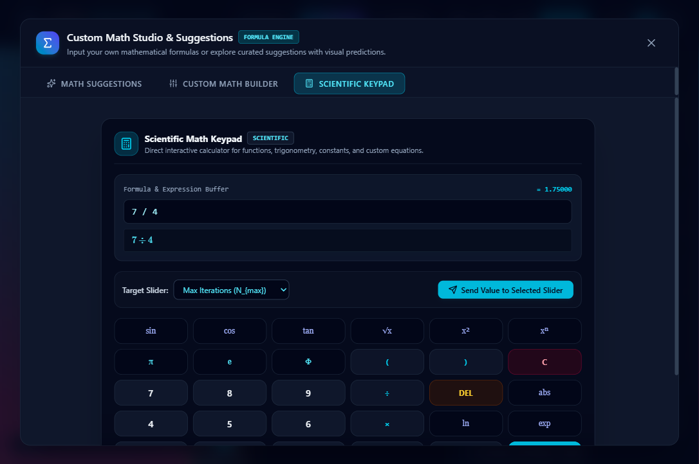
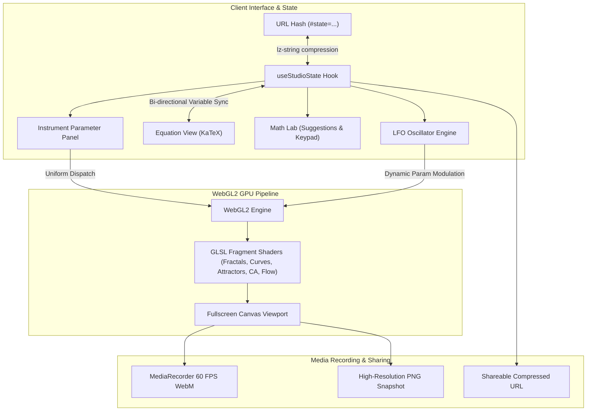

# Axiom: Generative Math & Art Studio

<div align="center">



**A high-performance WebGL2 shader laboratory bridging pure mathematics with generative visual art.**  
*Real-time GPU computation, bi-directional formula-to-parameter interactivity, and zero-database shareable state.*

[](https://www.typescriptlang.org/)
[](https://react.dev/)
[](https://www.khronos.org/webgl/)
[](https://tailwindcss.com/)
[](https://katex.org/)
[](https://github.com/)
[](LICENSE)

[🌐 Live Demo](https://github.com/) • [📖 English Guide](#english-documentation) • [🇹🇭 คู่มือภาษาไทย](#thai-documentation) • [🚀 Deploy to GitHub Pages](#github-pages-deployment-guide)

</div>

---

## Language Navigation / สารบัญภาษา
- [English Documentation](#english-documentation)
  - [1. Target Audience (Who)](#1-target-audience-who)
  - [2. Problem Statement (Problem)](#2-problem-statement-problem)
  - [3. The Solution (Solution)](#3-the-solution-solution)
  - [4. Core Capabilities & Mathematical Engines (Features)](#4-core-capabilities--mathematical-engines-features)
  - [5. Math Lab & Custom Equation Studio](#5-math-lab--custom-equation-studio)
  - [6. Technology Stack & Rationale (Tech Stack)](#6-technology-stack--rationale-tech-stack)
  - [7. System Architecture & Data Flow (Architecture)](#7-system-architecture--data-flow-architecture)
  - [8. GitHub Pages Deployment Guide](#8-github-pages-deployment-guide)
  - [9. Local Development & Verification](#9-local-development--verification)
- [คู่มือภาษาไทย (Thai Documentation)](#thai-documentation)
  - [1. กลุ่มผู้ใช้งานเป้าหมาย](#1-กลุ่มผู้ใช้งานเป้าหมาย)
  - [2. ปัญหาและจุดประสงค์ของการพัฒนา](#2-ปัญหาและจุดประสงค์ของการพัฒนา)
  - [3. วิธีการแก้ปัญหาและคุณค่าของระบบ](#3-วิธีการแก้ปัญหาและคุณค่าของระบบ)
  - [4. ระบบและเครื่องยนต์คณิตศาสตร์เชิงศิลป์](#4-ระบบและเครื่องยนต์คณิตศาสตร์เชิงศิลป์)
  - [5. ห้องทดลองสมการ Math Lab](#5-ห้องทดลองสมการ-math-lab)
  - [6. สถาปัตยกรรมและเทคโนโลยีที่ใช้](#6-สถาปัตยกรรมและเทคโนโลยีที่ใช้)
  - [7. วิธีการนำขึ้น GitHub Pages](#7-วิธีการนำขึ้น-github-pages)

---

<a name="english-documentation"></a>
# English Documentation

## 1. Target Audience (Who)
- **Creative Coders & Generative Artists**: Creators seeking high-impact, mathematically grounded procedural visuals without getting blocked by abstract formula barriers, providing immediate visual intuition on how coefficients affect geometry, phase, and filament density.
- **Mathematicians, STEM Educators & Researchers**: Professionals and academics seeking dynamic phase space projections of textbook formulas (complex dynamics, nonlinear chaos attractors, harmonic polar curves, cellular automata, curl turbulence) rendered at full 60 FPS GPU throughput.
- **Interactive Web Developers**: Engineers exploring high-performance WebGL2 shader pipelines, stateless URL compression codecs, and accessible mathematical typography.

---

## 2. Problem Statement (Problem)
Most generative art learners copy GLSL shaders and algorithmic formulas from tutorials without understanding what individual coefficients represent. Conversely, mathematical formulas in academic textbooks remain static and detached from visual reality.

**Axiom bridges this divide** by establishing an intuitive, bi-directional tactile feedback loop between algebraic symbols and GPU render uniforms:
1. Every formula symbol ($c_r, c_i, \rho, \sigma, k, \omega$) corresponds to a precision instrument slider.
2. Hovering over a variable highlights its exact role within the LaTeX equation.
3. Users can type and evaluate custom formulas directly via an interactive Scientific Keypad without writing boilerplate WebGL code.

---

## 3. The Solution (Solution)
A zero-latency, zero-database creative coding environment that transforms mathematical equations into live generative visual art:
- **Instant 60 FPS GPU Rendering**: All equations evaluate continuously on a WebGL2 fragment shader quad.
- **Bi-Directional Equation View**: KaTeX rendered mathematical equations synchronized with variable highlighting and pedagogical intuition notes.
- **Stateless URL Codec (`lz-string`)**: Entire workspace state (camera zoom, pan, equation parameters, color palette, LFO oscillator settings) compresses into a shareable URL hash.
- **Math Lab Studio**: Curated mathematical suggestions with visual outcome predictions, a live formula builder, and an interactive keypad.
- **Dynamic Dual Theme**: High-contrast Dark mode and glassmorphic Light mode.

---

## 4. Core Capabilities & Mathematical Engines (Features)

### A. Fractals & Complex Dynamics
- **Mandelbrot Multibrot**: $z_{n+1} = z_n^d + c, \; z_0 = 0$ with continuous smooth potential escape shading and multi-power support ($d \in [2, 8]$).
- **Julia Set Morphing**: $z_{n+1} = z_n^2 + C, \; C = C_r + i C_i$ with orbit trapping and continuous complex constant manipulation.
- **Burning Ship & Tricorn**: Non-analytic absolute value folding ($(|Re(z)| + i|Im(z)|)^2 + c$) and conjugate dynamics.

### B. Parametric Curves & Harmonographs
- **Rose (Rhodonea) Curves**: $r = a \cos\left(\frac{n}{d}\theta + \phi\right)$ with multi-revolution polar distance estimation and tunable laser glow bloom.
- **Lissajous Harmonographs**: Orthogonal sinusoidal harmonic waveforms $x = A \sin(at + \delta), \; y = B \sin(bt)$ forming 3D orbital loops.

### C. Strange Attractors & Chaos Theory
- **Lorenz Atmospheric Convection**: 3D system of nonlinear differential equations ($\dot{x} = \sigma(y - x), \; \dot{y} = x(\rho - z) - y, \; \dot{z} = xy - \beta z$) projected dynamically.
- **Clifford Attractor**: Discrete dynamical mapping generating gossamer translucent probability silk ribbons.

### D. Cellular Automata & Continuous Life
- Toroidal neighborhood summation with phosphor decay persistence ($\tau$) and interactive perturbation.

### E. Flow Fields & Vector Calculus
- Incompressible fluid vorticity evaluated via the curl of 3D Simplex noise ($\mathbf{v} = \nabla \times \psi, \; \nabla \cdot \mathbf{v} = 0$).

---

## 5. Math Lab & Custom Equation Studio

Math Lab provides three integrated creative tools:

| Tool Tab | Purpose & Capabilities | Visual |
| :--- | :--- | :---: |
| **Math Suggestions** | Curated mathematical formulas with **Visual Outcome Predictions** and aesthetic tags, explaining the visual geometry prior to generation. |  |
| **Custom Math Builder** | Interactive visual builder for Rose Harmonographs, Complex Fractals, and Lissajous Knots with live KaTeX preview and real-time prediction sentences. |  |
| **Scientific Keypad** | Interactive scientific calculator with trigonometric functions ($\sin, \cos, \tan$), mathematical constants ($\pi, e, \Phi$), and direct parameter injection. |  |

---

## 6. Technology Stack & Rationale (Tech Stack)

| Layer | Technology | Architectural Rationale |
| :--- | :--- | :--- |
| **GPU Render Engine** | WebGL2 + Custom GLSL Shaders | Fullscreen quad architecture with floating-point textures and 60 FPS fragment program evaluation. |
| **Client Framework** | React 19 + TypeScript 6 | Strict type safety, deterministic state management, and high-velocity HMR. |
| **Styling & Tokens** | Tailwind CSS v4 | Studio Instrument design system with tabular numbers, zero emojis, and glassmorphic surface tokens. |
| **Mathematical Typography** | KaTeX | Sub-millisecond LaTeX typesetting without external network requests. |
| **URL Serialization** | `lz-string` | URL-safe compressed hash codec enabling zero-database state sharing. |
| **Vector Icons** | Lucide React | 100% vector SVG icons conforming to modern UI standards. |

---

## 7. System Architecture & Data Flow (Architecture)



---

## 8. GitHub Pages Deployment Guide

Axiom is fully configured for automated GitHub Pages deployment:

### Step 1: Push Repository to GitHub
```powershell
git remote add origin https://github.com/<your-username>/<your-repo-name>.git
git branch -M master
git push -u origin master
```

### Step 2: Enable GitHub Pages in Repository Settings
1. Navigate to your repository on GitHub.
2. Click **Settings** > **Pages** (in the left sidebar).
3. Under **Build and deployment** > **Source**, select **GitHub Actions**.
4. The `.github/workflows/deploy.yml` workflow will automatically trigger on push, run static type checking, automated tests, build the bundle with relative paths (`base: './'`), and deploy live.

---

## 9. Local Development & Verification

```powershell
# 1. Clone the repository
git clone https://github.com/<your-username>/<your-repo-name>.git
cd <your-repo-name>

# 2. Install dependencies
npm install

# 3. Start local development server
npm run dev

# 4. Run test suite
npm test

# 5. Run static type check
npx tsc --noEmit

# 6. Build production bundle
npm run build
```

---

<a name="thai-documentation"></a>
# คู่มือภาษาไทย (Thai Documentation)

## 1. กลุ่มผู้ใช้งานเป้าหมาย
- **ครีเอทีฟโค้ดเดอร์และศิลปินดิจิทัล (Creative Coders & Visual Artists)**: ผู้ที่ต้องการสร้างสรรค์ผลงานภาพแนว Generative Art ที่สวยงามและมีรากฐานทางคณิตศาสตร์ โดยไม่ต้องมีวุฒิปริญญาด้านคณิตศาสตร์ขั้นสูง แต่ต้องการเข้าใจว่าพารามิเตอร์แต่ละตัวส่งผลต่อสมมาตรและเส้นสายอย่างไร
- **นักคณิตศาสตร์ นักการศึกษา และนักเรียนสาย STEM**: ผู้ที่ต้องการเห็นสมการในตำรา (พลวัตเชิงซ้อน, เคออสแอตแทรคเตอร์, เส้นโค้งฮาร์โมนิก, เซลลูลาร์ออโตมาตา, สนามเวกเตอร์) แปลงเป็นภาพการเคลื่อนไหวแบบ 60 FPS บน GPU แบบเรียลไทม์
- **นักพัฒนาเว็บ**: ผู้ที่สนใจศึกษาการประมวลผล WebGL2 GLSL Shaders, การบีบอัดสถานะบน URL ด้วย `lz-string` และการออกแบบ UI ที่รองรับสองภาษาอย่างไร้รอยต่อ

---

## 2. ปัญหาและจุดประสงค์ของการพัฒนา
คนส่วนใหญ่ที่เริ่มต้นทำ Generative Art มักใช้วิธีคัดลอกโค้ด Shader จากอินเทอร์เน็ตโดยไม่เข้าใจว่าตัวเลขหรือสูตรแต่ละจุดทำหน้าที่อะไร ในทางกลับกัน สมการคณิตศาสตร์ในตำราเรียนก็มักถูกนำเสนอเป็นสัญลักษณ์แบบนามธรรมที่จับต้องยาก

**Axiom ถูกออกแบบมาเพื่อผสานสองโลกเข้าด้วยกัน**:
1. แปลงตัวแปรทางคณิตศาสตร์ ($c_r, c_i, \rho, \sigma, k, \omega$) ให้กลายเป็นสไลเดอร์ที่ปรับค่าได้ทันที
2. ระบบ Bi-Directional Highlighting: เพียงชี้เมาส์ที่ตัวแปร ระบบจะไฮไลต์สัญลักษณ์ที่ตรงกันในสูตร LaTeX ทันที
3. ป้อนสูตรคำนวณและทดลองสมการได้เองผ่าน Scientific Keypad โดยไม่ต้องเขียนโค้ด WebGL พื้นฐานเอง

---

## 3. วิธีการแก้ปัญหาและคุณค่าของระบบ
สตูดิโอศิลปะคณิตศาสตร์ที่ทำงานบนเบราว์เซอร์ได้ทันทีโดยไม่ต้องเชื่อมต่อฐานข้อมูลภายนอก (Zero-Database Architecture):
- **ประมวลผลลื่นไหล 60 FPS**: คำนวณผ่าน WebGL2 Fragment Shader บน GPU โดยตรง
- **มุมมองสมการพร้อมคำอธิบาย (Equation View)**: แสดงผลสูตรคณิตศาสตร์ด้วย KaTeX พร้อมคำอธิบายความหมายเชิงคณิตศาสตร์
- **บันทึกสถานะลงบน URL**: บีบอัดค่าทั้งหมด (ตำแหน่งกล้อง, ซูม, พารามิเตอร์, ชุดสี, ค่า LFO) เป็น URL สั้นผ่าน `lz-string` เพื่อแชร์ผลงานได้ทันที
- **ระบบสองภาษา EN/TH**: สลับภาษาได้อย่างแม่นยำ ไม่เพี้ยน และคงความสวยงามของตัวอักษรภาษาไทย
- **โหมดมืด/สว่าง (Dark / Light Mode)**: ดีไซน์ระดับสตูดิโอแบบ Glassmorphism ที่ใช้งานได้สบายตาในทุกสภาพแสง

---

## 4. ระบบและเครื่องยนต์คณิตศาสตร์เชิงศิลป์

### ก. แฟร็กทัลและพลวัตเชิงซ้อน (Fractals & Complex Dynamics)
- **แมนเดลบรอตและมัลติโบรต์**: $z_{n+1} = z_n^d + c$ รองรับการเปลี่ยนเลขชี้กำลัง $d$ เพื่อสร้างสมมาตรหลายแฉก
- **การแปลงค่าคงที่จูเลีย (Julia Set Morphing)**: สำรวจระนาบเชิงซ้อน $C = C_r + i C_i$ แบบเรียลไทม์
- **เบิร์นนิงชิปและไตรคอร์น**: การสะท้อนค่าสัมบูรณ์และการสังยุคที่ให้ลวดลายแปลกตา

### ข. เส้นโค้งพาราเมตริกและฮาร์โมโนกราฟ (Parametric Curves)
- **เส้นโค้งกุหลาบ (Rose Curves)**: $r = a \cos\left(\frac{n}{d}\theta + \phi\right)$ พร้อมการคำนวณระยะทางแบบหลายรอบเพื่อสร้างใยแสงเลเซอร์โฮโลแกรม
- **ปมคลื่นลิสซาจูส์ (Lissajous Knots)**: การรวมคลื่นออร์โธโกนอลจนเกิดเป็นโครงสร้างสามมิติที่หมุนวน

### ค. เคออสแอตแทรคเตอร์ (Strange Attractors)
- **แอตแทรคเตอร์ลอเรนซ์ (Lorenz Attractor)**: แบบจำลองการพาความร้อนในบรรยากาศที่มีปีกผีเสื้อคู่และเส้นทางที่ไม่เคยตัดกัน
- **แอตแทรคเตอร์คลิฟฟอร์ด (Clifford Attractor)**: การทำแผนที่พลวัตไม่เชิงเส้นที่ก่อให้เกิดริบบิ้นความน่าจะเป็นโปร่งแสงคล้ายม่านไหม

### ง. เซลลูลาร์ออโตมาตาและสนามเวกเตอร์ (Cellular Automata & Flow Fields)
- จำลองการเกิดและสลายของเซลล์บนพื้นผิวโทรัส พร้อมการค้างของแสงฟอสเฟอร์
- กระแสวนของของไหลคำนวณผ่าน Curl ของ 3D Simplex Noise ($\mathbf{v} = \nabla \times \psi$)

---

## 5. ห้องทดลองสมการ Math Lab

Math Lab รวม 3 เครื่องมือสำคัญไว้ในที่เดียว:

1. **สมการแนะนำ (Math Suggestions)**:
   - คลังสมการที่คัดสรรมาเป็นพิเศษ พร้อม **Visual Outcome Prediction** บรรยายผลลัพธ์ภาพที่จะได้ล่วงหน้า
   - แท็กบอกลักษณะทางเรขาคณิต (เช่น สมมาตร 4 ทิศ, ผลึกหิมะ, สถาปัตยกรรมโกธิค)
2. **ระบบสร้างสมการเอง (Custom Math Builder)**:
   - เลือกกระบวนทัศน์คณิตศาสตร์ (กุหลาบ, แฟร็กทัล, ลิสซาจูส์)
   - ดูตัวอย่างสูตรคณิตศาสตร์แบบ Live LaTeX พร้อมการทำนายภาพแบบเรียลไทม์
   - ปรับแต่งค่าพารามิเตอร์และกดประมวลผลเข้าสู่สตูดิโอได้ทันที
3. **แป้นพิมพ์วิทยาศาสตร์ (Scientific Keypad)**:
   - เครื่องคิดเลขวิทยาศาสตร์ในตัว รองรับตรีโกณมิติ ($\sin, \cos, \tan$), ค่าคงที่ ($\pi, e, \Phi$), ยกกำลัง, รากที่สอง
   - สามารถคำนวณและส่งค่าตัวเลขเข้าสู่สไลเดอร์ที่เลือกได้โดยตรง

---

## 6. สถาปัตยกรรมและเทคโนโลยีที่ใช้

- **WebGL2 & GLSL 3.00 ES**: ประมวลผลกราฟิกและคณิตศาสตร์ระดับพิกเซลบนการ์ดจอ 60 FPS
- **React 19 & TypeScript 6**: สถาปัตยกรรมคอมโพเนนต์ที่รัดกุม ปลอดภัยจากข้อผิดพลาดด้านชนิดข้อมูล
- **Tailwind CSS v4**: ออกแบบโทเคนสีและอินเทอร์เฟซแบบ Instrument Register ที่คมชัด
- **KaTeX**: เรนเดอร์สูตรคณิตศาสตร์ LaTeX ภายในเสี้ยววินาที
- **lz-string**: อัลกอริทึมบีบอัดสถานะห้องทดลองลงบน URL แบบไร้เซิร์ฟเวอร์
- **Lucide Icons**: ไอคอนเวกเตอร์ SVG คุณภาพสูง 100% ไร้อิโมจิแปลกปลอม

---

## 7. วิธีการนำขึ้น GitHub Pages

โปรเจกต์นี้ได้รับการตั้งค่าให้รองรับการ Build และ Deploy สู่ **GitHub Pages** อัตโนมัติ:

1. นำโค้ดขึ้นสู่ GitHub Repository:
   ```powershell
   git remote add origin https://github.com/<ชื่อผู้ใช้>/<ชื่อโปรเจกต์>.git
   git branch -M master
   git push -u origin master
   ```
2. ไปที่หน้า GitHub Repository ของคุณ > คลิก **Settings** > **Pages**
3. ในส่วน **Build and deployment** > หัวข้อ **Source** ให้เลือกเป็น **GitHub Actions**
4. ระบบ GitHub Actions จะทำงานตามไฟล์ `.github/workflows/deploy.yml` โดยอัตโนมัติ (ทำการ Type Check, รัน Unit Test, Build เว็บด้วย Relative Base Path และปล่อยขึ้นออนไลน์ทันที)

---

## License
MIT License © 2026 Axiom Studio Contributors.
