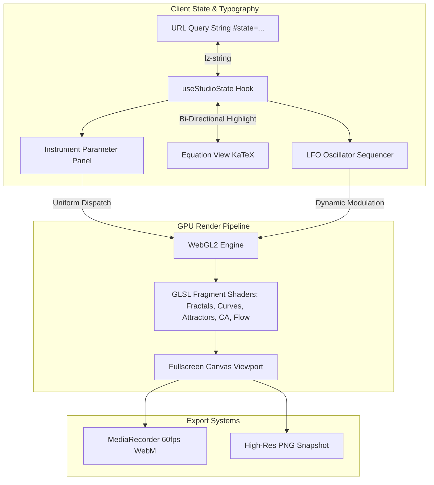

# Axiom: Generative Math & Art Studio

> A high-performance WebGL2 shader studio bridging mathematical rigor with generative visual art. Designed for creative coders and mathematicians to explore, understand, and share mathematical aesthetics through real-time GPU computation and bi-directional equation-to-parameter interactivity.

---

## 1. Target Personas (Who)

- **Creative Coders & Visual Artists**: Creators who want stunning procedural visuals without needing a graduate degree in mathematics, but who crave deep intuition into how each scalar variable alters geometric symmetry, phase space, and filament density.
- **Mathematicians, STEM Students & Educators**: Scholars who want to see textbook equations (complex dynamics, strange attractors, polar harmonographs, cellular automata, curl noise) translated into fluid, real-time 60fps GPU phase projections.

---

## 2. Core Problem Solved (Problem)

Most generative art practitioners copy shader code from tutorials or Shadertoy without understanding the underlying math. Conversely, mathematical equations in textbooks remain static, abstract symbols. 

**Axiom eliminates this divide** by creating a direct, bi-directional tactile bridge between algebraic formulas and real-time GPU evaluation. Sliders directly correspond to mathematical variables ($c_r, \rho, \sigma, k, \omega$), and hovering over an equation symbol instantly highlights the slider controlling it.

---

## 3. The Value Proposition (Solution)

Axiom delivers a zero-latency, zero-database studio where:
- Every mathematical model evaluates at continuous 60fps via custom WebGL2 GLSL fragment shaders.
- The **Equation View** renders dynamic KaTeX formulas with bi-directional hover synchronization.
- Any configuration (coordinates, zoom, custom parameters, palette, LFO oscillations) serializes into a compressed URL hash via `lz-string` for instant sharing without backend databases.
- Parameter motion synthesis allows LFO modulation and direct 60fps video recording.

---

## 4. Key Capabilities & Mathematical Engines (Features)

### 1. Fractals & Complex Dynamics
- **Mandelbrot Set**: $z_{n+1} = z_n^2 + c, \; z_0 = 0$ with continuous potential coloring and multi-power support ($z^d + c$).
- **Julia Set Morphing**: $z_{n+1} = z_n^2 + C, \; C = C_r + i C_i$ with orbit trapping and real-time complex constant morphing.
- **Burning Ship**: $z_{n+1} = (|Re(z_n)| + i|Im(z_n)|)^2 + c$ non-analytic absolute value folding.

### 2. Parametric Curves & Harmonographs
- **Rose (Rhodonea) Curves**: $r = a \cos\left(\frac{n}{d} \theta\right)$ with multi-turn polar distance estimation and laser glow bloom.
- **Lissajous Harmonographs**: $x = A \sin(at + \delta), \; y = B \sin(bt)$ with 3D rotational phase sweep.

### 3. Strange Attractors
- **Lorenz Chaotic Attractor**: Continuous differential equations of atmospheric convection ($\dot{x}=\sigma(y-x), \dot{y}=x(\rho-z)-y, \dot{z}=xy-\beta z$) projected dynamically into 3D phase space.
- **Clifford Attractor**: Pickover discrete dynamical mapping ($x_{n+1} = \sin(ay_n) + c\cos(ax_n)$) forming gossamer probability ribbons.

### 4. Cellular Automata & Continuous Life
- Toroidal neighborhood sum evolution with phosphor persistence ($\tau$) and spontaneous perturbation.

### 5. Flow Fields & Vector Calculus
- Incompressible fluid vorticity via the curl of 3D Simplex noise ($\mathbf{v} = \nabla \times \psi, \nabla \cdot \mathbf{v} = 0$).

### 6. Bi-Directional Equation View (Pedagogical Core)
- High-fidelity LaTeX typography via KaTeX.
- Cross-highlighting: hovering or dragging a parameter slider illuminates the exact algebraic symbol in the equation, accompanied by concise mathematical intuition notes.

### 7. Motion Synthesizer & Video Export
- LFO modulation engine (Sine, Triangle, Sawtooth waveforms) to animate any uniform continuously.
- 60fps WebM/MP4 canvas stream recording and 4K PNG snapshot export.

---

## 5. Technology Stack (Tech Stack)

| Layer | Technology | Architectural Rationale |
| :--- | :--- | :--- |
| **GPU Render Engine** | WebGL2 + Custom GLSL Shaders | Uncompromised 60fps GPU evaluation on fullscreen quad with single-pass and multi-sample fragment programs. |
| **Frontend Framework** | React 19 + TypeScript | Strict type safety, clean reactive state bindings, and rapid HMR. |
| **Styling & Design Tokens** | Tailwind CSS v4 | Studio Instrument Register conforming to strict UI standards: tabular numerals, 0 emojis, 4-state micro-interactions. |
| **Mathematical Typography** | KaTeX | Sub-millisecond LaTeX mathematical formula typesetting. |
| **State Compression** | `lz-string` | URL-safe compressed serialization for zero-database shareable links. |
| **Vector Iconography** | Lucide React | 100% crisp vector SVGs (zero Unicode emojis). |

---

## 6. Architecture & Data Flow (Architecture)



---

## 7. Verification & Testing Evidence

```powershell
# Run automated state serialization & codec tests
npm test

# Verify production build and strict TypeScript compilation
npm run build
```

---

## 8. Getting Started

```powershell
# Clone or navigate to the repository
cd math-generative-art-studio

# Install dependencies
npm install

# Start development server
npm run dev
```
